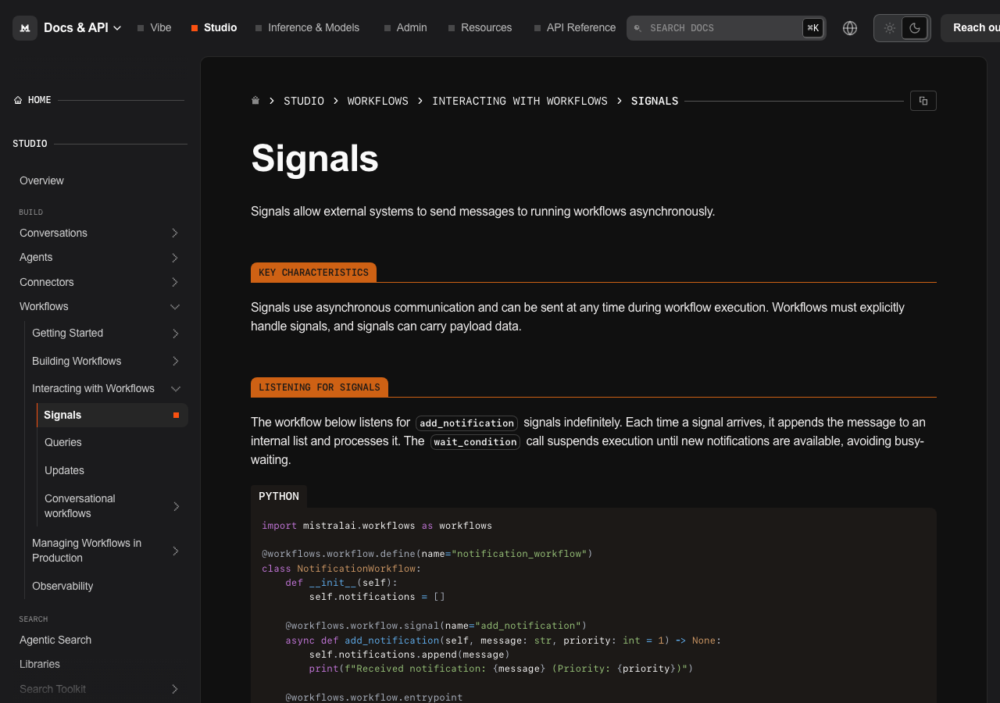
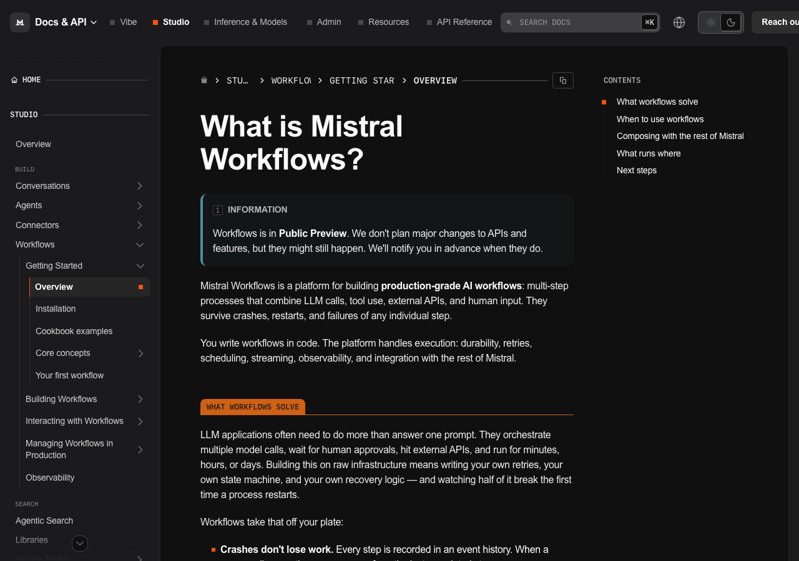

# The Invoice Automation Lab: Build a Payables Robot with Mistral Workflows

## Overview

Every company has someone who stares at invoice photos and types numbers into a
spreadsheet. In this lab you build that person a robot: a durable pipeline that
reads 18 real invoice photos with **Mistral OCR**, extracts **typed JSON**
(invoice number, date, amount, supplier, bank details, spend category), enriches
each record with CRM data, and **pauses for human approval** on anything over
$3,000. Then — the fun part — you kill it mid-run and watch it resume exactly
where it left off.

Everything runs on the [`mistralai-workflows`](https://pypi.org/project/mistralai-workflows/)
SDK (`import mistralai.workflows as workflows`). Mistral's managed Temporal
engine checkpoints every step: failures trigger retries, and pipelines can
pause and resume without losing state.

> Every command is copy-paste runnable, and every phase ends with a checkpoint.
> Do not skip the crash test.

### Prerequisites

- Python 3.12+, [`uv`](https://docs.astral.sh/uv/) (`pip install uv`), `git`
- A [Mistral account](https://auth.mistral.ai/ui/login) — free tier works

### What You'll Learn

- Define durable workflows and activities with `mistralai.workflows`
- Extract structured JSON from document images with OCR plus chat completions
- Pause a workflow for human approval and resume it with a **signal**
- Trigger, poll, and signal executions from the Mistral Python client
- Crash a pipeline mid-run and resume it without losing work
- Publish the workflow to **Le Chat** as an assistant

### What You'll Need

- An API key from the [Mistral Console](https://console.mistral.ai/)
  (**API Keys** → *Create new key* — shown only once, copy it now)
- ~200 MB of disk for the Python environment
- The lab processes a handful of invoices; costs pennies, fits in trial credit

### What You'll Build


Four activities, one human gate, wired end to end. The finished artifact is a
forkable repo you can point at any document folder — plus, optionally, a Le
Chat assistant your whole organization can invoke.

## Set Up Your Lab

```bash
git clone https://github.com/vinitshetty/mistral-ai-studio-quickstart.git
cd mistral-ai-studio-quickstart
uv sync
cp .env.example .env
# open .env and set MISTRAL_API_KEY=<your key>
```

Two other variables in `.env` matter:

- `SERVER_URL` — keep the default `https://api.mistral.ai`
- `DEPLOYMENT_NAME` — a stable name for this worker (the template uses
  `invoice-parser`). The SDK uses it as the task queue, so executions are
  routed to workers sharing the name.

Verify the install:

```bash
uv run python -c "import mistralai.workflows; print('Workflows is installed successfully!')"
```

**Checkpoint:** the command prints `Workflows is installed successfully!`

## Extract Your First Invoice

Prove the magic works before touching workers or queues. This script calls two
activities directly — OCR, then extraction — on the first invoice photo:

```bash
uv run --frozen python workflows/utils/test.py
```

Expected output (abbreviated):

```
Reading document from: invoices/batch1-1472.jpg
ITEMS

|  No. | Description | Qty | UM | Net price | Net worth | VAT [%] | Gross worth  |
| --- | --- | --- | --- | --- | --- | --- | --- |
|  1. | EU Blichmann Riptide Brewing Pump - Hombrew Beer Wine ...
Structured Output result: invoice_number='97833274' date='2014-03-09'
total_amount=440.0 bank_details='GB88PASK22658399910069'
supplier='Baker, Pearson and Perry' invoice_category='raw_materials'
```

Two things happened, both defined in `workflows/workflow/worker.py`:

- `process_document_ocr` base64-encodes the photo and calls
  `mistral-ocr-latest`, which returns markdown per page — it even recovered the
  line-items table.
- `extract_invoice_data` sends that markdown to `mistral-large-latest` with a
  strict JSON schema (`response_format={"type": "json_schema", ...}`), then
  validates the reply with `InvoiceData.model_validate_json`. Bad extractions
  cannot pass the type check.

**Checkpoint:** a photo became six typed fields — including the supplier's
bank account — in under ten minutes.

## Start the Worker

A **worker** connects outbound to Mistral and pulls work from a task queue;
your workflow runs nowhere until one is live:

```bash
uv run --frozen python workflows/workflow/worker.py
```

Watch for two lines:

```
Workflow registered WITHOUT versioning behavior ... workflow_name=ocr_invoice_workflow_test
Registered activities ... ['...', 'process_document_ocr', 'extract_invoice_data',
'data_enrichment_with_mcp', 'send_to_validation']
```

The worker fetched its Temporal settings from your API key (config discovery)
and is polling the task queue named after your `DEPLOYMENT_NAME`. Leave this
terminal running. Kill the worker and executions simply wait; start it again
and work resumes — you will exploit this shortly.

**Checkpoint:** the `Registered activities` line lists your four activities.

## Run the Full Pipeline

In a second terminal, process a single invoice:

```bash
uv run --frozen python workflows/workflow/run.py invoices/batch1-1472.jpg
```

Expected output:

```
[batch1-1472.jpg] Workflow started. Waiting for completion...
======================================================================
Invoice processing complete.

**Invoice #97833274**
- Supplier: Baker, Pearson and Perry
- Date: 2014-03-09
- Amount: $440.00
- Category: raw_materials
- Decision: APPROVED
- Required approval: False
======================================================================
```

`run.py` drives the pipeline through the Mistral Python client:

```python
client = Mistral(server_url=os.environ["SERVER_URL"], api_key=os.environ["MISTRAL_API_KEY"])

await client.workflows.execute_workflow_async(          # trigger
    workflow_identifier="ocr_invoice_workflow_test",
    input=OCRWorkflowInput(document_path=document_path),
    execution_id=execution_id,
    deployment_name=os.environ.get("DEPLOYMENT_NAME"),
)
response = await client.workflows.wait_for_workflow_completion_async(execution_id)  # poll
```

Inside the workflow, the four activities run under a **TodoList** — a live
progress widget you can watch streaming in AI Studio's execution timeline.

$440 is under the threshold, so approval was skipped. Time for a more expensive
problem.

**Checkpoint:** your summary shows a supplier, an amount, and `Decision: APPROVED`.

## Play Approving Manager

Run the big invoice:

```bash
uv run --frozen python workflows/workflow/run.py invoices/batch1-1480.jpg
```

This one totals **$9,556.58**, so the workflow parks on
`wait_for_input(InvoiceApprovalForm)` — an approve/reject form — and the
runner prints the command to act on it:

```
[batch1-1480.jpg] To approve: uv run python workflows/utils/approve.py <execution-id>
```

In a third terminal, be the manager:

```bash
uv run --frozen python workflows/utils/approve.py <execution-id>          # approve
uv run --frozen python workflows/utils/approve.py <execution-id> --reject # reject
```

The script sends a **signal** — a named message to a running execution:

```python
await client.workflows.executions.signal_workflow_execution_async(
    execution_id=execution_id,
    name="approve",
    input={"approved": approved},   # plain dict matching the signal's schema
)
```

The paused workflow wakes, reads the decision, and finishes:

```
**Invoice #77404624**
- Supplier: Hayes-Mcdonald
- Amount: $9556.58
- Decision: APPROVED
- Required approval: True
```

Signals are a general primitive — see the
[signals reference](https://docs.mistral.ai/studio/workflows/interacting-with-workflows/signals).



**Checkpoint:** an invoice above $3,000 cannot complete until a human says so.

## Crash It On Purpose

The signature move. `run_w_resume.py` processes all 18 invoices with
**deterministic execution IDs** (`invoice-<name>-<run-id>`):

- `COMPLETED` → skip
- `RUNNING` → attach and wait
- `FAILED` / `TIMED_OUT` / `CANCELED` → re-execute with the same ID

Start a batch, then kill it mid-flight:

```bash
uv run --frozen python workflows/workflow/run_w_resume.py labrun1
# ... invoices are streaming through OCR ... now Ctrl+C
uv run --frozen python workflows/workflow/run_w_resume.py labrun1
```

Expected output on the second pass:

```
[batch1-1472.jpg] Already completed, skipping.
[batch1-1475.jpg] Already running (status=RUNNING), attaching...
[batch1-1479.jpg] Previous run ended with status=FAILED, re-executing...
```

Nothing is re-OCR'd from scratch. The Temporal engine holds the workflow's
state server-side — which is why "just restart it" is a valid production
strategy for this pipeline.

> Use the same run ID to resume; a new ID reprocesses everything.

**Checkpoint:** the second run skips everything the first run finished.

## Publish to Le Chat

You have been approving invoices from a terminal. Give everyone else a chat
button instead:

1. Open the [Mistral Console](https://console.mistral.ai/) » **Workflows** —
   your `OCR Invoice Workflow Test` is there with its executions, timeline,
   and pending-input events.
2. Click **Publish** → **Assist**.
3. Open [Le Chat](https://chat.mistral.ai/), find your workflow under
   assistants, and send it an invoice document.

The workflow appears as a conversational assistant: it streams TodoList
progress as it works, and a $9,556 invoice renders the approval form right in
the chat. Approving is a click.

**Checkpoint:** a colleague with zero terminals installed can now process an
invoice end to end.

## Troubleshooting

- **`ValueError: DEPLOYMENT_NAME is required`** — set `DEPLOYMENT_NAME` in
  `.env`, and use the same value for worker and runners.
- **`Failed validating workflow`** with `RestrictedWorkflowAccessError` — the
  Temporal sandbox caught a non-deterministic import. Keep activity-only
  imports (the `Mistral` client, `httpx`, `aiohttp`) inside
  `with workflow.unsafe.imports_passed_through():`, as this repo does.
- **`Input should be a valid dictionary`** when signaling — the signal `input`
  must be a plain dict, not a pydantic model.
- **`401` / `Unauthorized`** — check `MISTRAL_API_KEY` in `.env`.

## Conclusion and Resources

### What You Learned

You defined a durable workflow with four activities, turned document photos
into typed records with OCR plus a strict JSON schema, gated expensive
invoices behind a human signal, drove executions from the Mistral Python
client, proved crash-resilience with deterministic execution IDs, and
published the workflow to Le Chat.

### What You Accomplished

A payables robot: 18 invoice photos in, structured records out, human approval
for anything over $3,000, durable execution that shrugs off worker crashes,
and an org-wide chat interface. Point it at your own documents by changing
one folder path.

### Next Steps

- Swap the simulated CRM activity for a real one — or an MCP server via the
  [connectors plugin](https://docs.mistral.ai/studio/workflows/building-workflows/connectors)
- Give the robot a [schedule](https://docs.mistral.ai/studio/workflows/building-workflows/scheduling)
- Add LLM-as-a-judge evaluation of extractions with the
  [evaluations toolkit](https://docs.mistral.ai/studio/observability/evaluations/evaluators)
- Go deeper with [core concepts](https://docs.mistral.ai/studio/workflows/getting-started/core_concepts)



### Related Resources

- [Mistral Workflows overview](https://docs.mistral.ai/studio/workflows/getting-started/overview)
- [Your first workflow](https://docs.mistral.ai/studio/workflows/getting-started/your_first_workflow)
- [Workflows cookbook examples](https://docs.mistral.ai/studio/workflows/getting-started/cookbook_examples)
- [Waiting for conditions](https://docs.mistral.ai/studio/workflows/building-workflows/waiting_for_conditions)
- [Deployments in production](https://docs.mistral.ai/studio/workflows/managing-workflows-in-production/deployments)
- [Document processing overview](https://docs.mistral.ai/studio/document-processing/overview)
- [mistralai-workflows on PyPI](https://pypi.org/project/mistralai-workflows/)
- [Lab repository — fork it](https://github.com/vinitshetty/mistral-ai-studio-quickstart)
