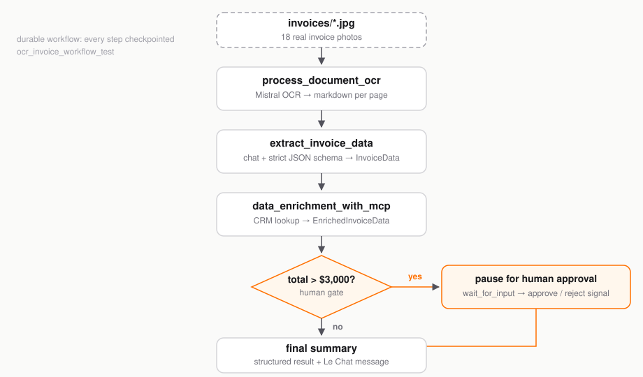

# The Invoice Automation Lab: Explore, Then Automate

## Overview

Every company has someone who stares at invoice photos and types numbers into a
spreadsheet. In this lab you build that person a robot — twice.

**Part 1 — Exploration** happens entirely in the Mistral Console UI: you prompt
a model in the Playground, force its output into clean JSON, deploy it as an
agent your whole org can use in Vibe, watch live traffic, and set up an
LLM-as-a-judge to score extractions. Zero code.

**Part 2 — Automation** turns that manual agent into a durable pipeline with
the [`mistralai-workflows`](https://pypi.org/project/mistralai-workflows/) SDK
(`import mistralai.workflows as workflows`): Mistral OCR reads 18 real invoice
photos, a chat model extracts typed JSON, and anything over $3,000 **pauses for
human approval**. Then — the fun part — you kill the pipeline mid-run and watch
it resume exactly where it left off.

The guide lives in the [devguides repo](https://github.com/vinitshetty/mistral-devguides);
the runnable lab — code, 18 sample invoices, lockfile — lives in its own repo,
[vinitshetty/invoice-automation](https://github.com/vinitshetty/invoice-automation),
so one fork gets you a clean working project.

> Every command is copy-paste runnable, and every phase ends with a checkpoint.
> Do not skip the crash test.

### Prerequisites

- Python 3.12+, [`uv`](https://docs.astral.sh/uv/) (`pip install uv`), `git`
- A [Mistral account](https://auth.mistral.ai/ui/login) — free tier works

### What You'll Learn

- Constrain LLM output to a strict JSON schema in the Playground
- Deploy an agent to Vibe for org-wide access
- Monitor live traffic, build datasets, and score extractions with LLM-as-a-judge
- Define durable workflows and activities with `mistralai.workflows`
- Extract structured JSON from document images with OCR plus chat completions
- Pause a workflow for human approval and resume it with a **signal**
- Crash a pipeline mid-run and resume it without losing work

### What You'll Need

- An API key from the [Mistral Console](https://console.mistral.ai/)
  (**API Keys** → *Create new key* — shown only once, copy it now)
- ~200 MB of disk for the Python environment
- Costs pennies across the whole lab; fits in trial credit

### What You'll Build

Part 1: a deployed `invoice-extractor-v1` agent answering in Vibe.
Part 2: the pipeline below — four activities, one human gate, wired end to end.



## Part 1 — Exploration

### Prompt in the Playground

**Navigate to:** Mistral Console » **Playground**. Paste this sample vendor email:

```
Hey there! Hope you're doing well. Just sending over the bill for last week's
catering from Downtown Delights. It came out to $452.10. Let me know when
you've sent the wire!
```

Send the prompt:

```
Help me process this invoice email.
```

You get a conversational, inconsistent reply — fine for a human, useless for
automation. The next step fixes that.

### Constrain the Output

Open the **Instructions** panel and paste:

```
Act as a specialized data extraction assistant.

Your task is to process the following email text and extract the
'supplier_name' and the 'total_amount'.

Rules:
1. Extract 'supplier_name' as a string.
2. Extract 'total_amount' as a float (number only, remove currency symbols).
3. If information is missing, use null.
4. Output the result strictly in JSON format with the two fields
'supplier_name' and 'total_amount'. Don't add a "properties" field.
```

Open **Response Format**, switch to JSON mode, and define this schema:

```json
{
  "type": "object",
  "required": ["supplier_name", "total_amount"],
  "properties": {
    "supplier_name": { "type": "string" },
    "total_amount": { "type": "number" }
  }
}
```

Re-run the same email. Now the reply is a predictable, database-ready object:

```json
{ "supplier_name": "Downtown Delights", "total_amount": 452.10 }
```

**Checkpoint:** the same prompt now returns the same shape every single time.

### Deploy the Agent

1. Click **Create Agent** (top right), name it `invoice-extractor-v1`.
2. Choose **Deploy to Vibe**, then **Open in Vibe**.
3. Test it with a second invoice, no code involved:

```
Hey, this is "Boulangerie de Paris", you owe me 5€ for the croissants
```

Your agent is live and usable across your organization. See
[Agents in AI Studio](https://docs.mistral.ai/studio/agents/introduction) for
the full feature set.

**Checkpoint:** Vibe replies with structured JSON from your deployed agent.

### Read a Real Invoice

The agent handles email text. Real invoices are photos. **Navigate to:**
AI Studio » **Document AI**, upload `batch1-1472.jpg` from the lab repo (or any
invoice image), and inspect the structured extraction — OCR, layout, and
multi-page handling with no preprocessing.

You have now seen every ingredient manually. Time to wire them into a pipeline
that runs itself. The [Document AI overview](https://docs.mistral.ai/studio/document-processing/overview)
is the reference.

**Checkpoint:** an invoice photo becomes structured key-values in the console.

## Part 2 — Automation

### Set Up the Lab

Clone the lab repo (code + 18 sample invoices) and install dependencies:

```bash
git clone https://github.com/vinitshetty/invoice-automation.git
cd invoice-automation
uv sync
cp .env.example .env
# open .env and set MISTRAL_API_KEY=<your key>
```

Two other variables in `.env` matter:

- `SERVER_URL` — keep the default `https://api.mistral.ai`
- `DEPLOYMENT_NAME` — a stable name for this worker (the template uses
  `invoice-parser`). The SDK uses it as the task queue, so executions are
  routed to workers sharing the name.

Verify the install:

```bash
uv run python -c "import mistralai.workflows; print('Workflows is installed successfully!')"
```

**Checkpoint:** the command prints `Workflows is installed successfully!`

### Extract Your First Invoice

Prove the pipeline works before touching workers or queues. This script calls
two activities directly — OCR, then extraction — on the first invoice photo:

```bash
uv run --frozen python workflows/utils/test.py
```

Expected output (abbreviated):

```
Reading document from: invoices/batch1-1472.jpg
ITEMS

|  No. | Description | Qty | UM | Net price | Net worth | VAT [%] | Gross worth  |
| --- | --- | --- | --- | --- | --- | --- | --- |
|  1. | EU Blichmann Riptide Brewing Pump - Hombrew Beer Wine ...
Structured Output result: invoice_number='97833274' date='2014-03-09'
total_amount=440.0 bank_details='GB88PASK22658399910069'
supplier='Baker, Pearson and Perry' invoice_category='raw_materials'
```

Both activities live in `workflows/workflow/worker.py`:

- `process_document_ocr` base64-encodes the photo and calls
  `mistral-ocr-latest`, which returns markdown per page — it even recovered the
  line-items table.
- `extract_invoice_data` sends that markdown to `mistral-large-latest` with a
  strict JSON schema (`response_format={"type": "json_schema", ...}`), then
  validates the reply with `InvoiceData.model_validate_json`. Bad extractions
  cannot pass the type check.

**Checkpoint:** a photo became six typed fields — including the supplier's
bank account — in under ten minutes.

### Start the Worker

A **worker** connects outbound to Mistral and pulls work from a task queue;
your workflow runs nowhere until one is live:

```bash
uv run --frozen python workflows/workflow/worker.py
```

Watch for two lines:

```
Workflow registered WITHOUT versioning behavior ... workflow_name=ocr_invoice_workflow_test
Registered activities ... ['...', 'process_document_ocr', 'extract_invoice_data',
'data_enrichment_with_mcp', 'send_to_validation']
```

The worker fetched its Temporal settings from your API key (config discovery)
and is polling the task queue named after your `DEPLOYMENT_NAME`. Leave this
terminal running. Kill the worker and executions simply wait; start it again
and work resumes — you will exploit this shortly.

**Checkpoint:** the `Registered activities` line lists your four activities.

### Run the Full Pipeline

In a second terminal, process a single invoice:

```bash
uv run --frozen python workflows/workflow/run.py invoices/batch1-1472.jpg
```

Expected output:

```
[batch1-1472.jpg] Workflow started. Waiting for completion...
======================================================================
Invoice processing complete.

**Invoice #97833274**
- Supplier: Baker, Pearson and Perry
- Date: 2014-03-09
- Amount: $440.00
- Category: raw_materials
- Decision: APPROVED
- Required approval: False
======================================================================
```

`run.py` drives the pipeline through the Mistral Python client:

```python
client = Mistral(server_url=os.environ["SERVER_URL"], api_key=os.environ["MISTRAL_API_KEY"])

await client.workflows.execute_workflow_async(          # trigger
    workflow_identifier="ocr_invoice_workflow_test",
    input=OCRWorkflowInput(document_path=document_path),
    execution_id=execution_id,
    deployment_name=os.environ.get("DEPLOYMENT_NAME"),
)
response = await client.workflows.wait_for_workflow_completion_async(execution_id)  # poll
```

Inside the workflow, the four activities run under a **TodoList** — a live
progress widget you can watch streaming in AI Studio's execution timeline.

$440 is under the threshold, so approval was skipped. Time for a more expensive
problem.

**Checkpoint:** your summary shows a supplier, an amount, and `Decision: APPROVED`.

### Play Approving Manager

Run the big invoice:

```bash
uv run --frozen python workflows/workflow/run.py invoices/batch1-1480.jpg
```

This one totals **$9,556.58**, so the workflow parks on
`wait_for_input(InvoiceApprovalForm)` — an approve/reject form — and the
runner prints the command to act on it:

```
[batch1-1480.jpg] To approve: uv run python workflows/utils/approve.py <execution-id>
```

In a third terminal, be the manager:

```bash
uv run --frozen python workflows/utils/approve.py <execution-id>          # approve
uv run --frozen python workflows/utils/approve.py <execution-id> --reject # reject
```

The script sends a **signal** — a named message to a running execution:

```python
await client.workflows.executions.signal_workflow_execution_async(
    execution_id=execution_id,
    name="approve",
    input={"approved": approved},   # plain dict matching the signal's schema
)
```

The paused workflow wakes, reads the decision, and finishes:

```
**Invoice #77404624**
- Supplier: Hayes-Mcdonald
- Amount: $9556.58
- Decision: APPROVED
- Required approval: True
```

**Checkpoint:** an invoice above $3,000 cannot complete until a human says so.

### Crash It On Purpose

The signature move. `run_w_resume.py` processes all 18 invoices with
**deterministic execution IDs** (`invoice-<name>-<run-id>`):

- `COMPLETED` → skip
- `RUNNING` → attach and wait
- `FAILED` / `TIMED_OUT` / `CANCELED` → re-execute with the same ID

Start a batch, then kill it mid-flight:

```bash
uv run --frozen python workflows/workflow/run_w_resume.py labrun1
# ... invoices are streaming through OCR ... now Ctrl+C
uv run --frozen python workflows/workflow/run_w_resume.py labrun1
```

Expected output on the second pass:

```
[batch1-1472.jpg] Already completed, skipping.
[batch1-1475.jpg] Already running (status=RUNNING), attaching...
[batch1-1479.jpg] Previous run ended with status=FAILED, re-executing...
```

Nothing is re-OCR'd from scratch. Mistral's managed Temporal engine holds the
workflow's state server-side — which is why "just restart it" is a valid
production strategy for this pipeline.

> Use the same run ID to resume; a new ID reprocesses everything.

**Checkpoint:** the second run skips everything the first run finished.

### Publish the Workflow

Part 1 deployed a chat agent. Publish the automated pipeline the same way:

1. Open the [Mistral Console](https://console.mistral.ai/) » **Workflows** —
   your `OCR Invoice Workflow Test` is there with its executions, timeline,
   and pending-input events.
2. Click **Publish to Vibe**.
3. Open [Vibe](https://vibe.mistral.ai/), find your workflow under
   assistants, and send it an invoice document.

The workflow appears as a conversational assistant: it streams TodoList
progress as it works, and a $9,556 invoice renders the approval form right in
the chat. Approving is a click.

**Checkpoint:** a colleague with zero terminals installed can now process an
invoice end to end.

## Troubleshooting

- **`ValueError: DEPLOYMENT_NAME is required`** — set `DEPLOYMENT_NAME` in
  `.env`, and use the same value for worker and runners.
- **`Failed validating workflow`** with `RestrictedWorkflowAccessError` — the
  Temporal sandbox caught a non-deterministic import. Keep activity-only
  imports (the `Mistral` client, `httpx`, `aiohttp`) inside
  `with workflow.unsafe.imports_passed_through():`, as this repo does.
- **`Input should be a valid dictionary`** when signaling — the signal `input`
  must be a plain dict, not a pydantic model.
- **`401` / `Unauthorized`** — check `MISTRAL_API_KEY` in `.env`.
- **Agent not visible in Vibe** — in the Console, check the agent's
  deployment status under **Agents**; deploying to Vibe can take a minute.

## Conclusion and Resources

### What You Learned

You constrained LLM output with a strict JSON schema, deployed an agent to Le
Chat, built an evaluation loop with datasets and an LLM judge, and read
invoice photos with Document AI. Then you turned that manual setup into a
durable workflow: four activities, OCR-to-typed-records, a human approval
signal gate, crash-resumable batches, and an org-wide chat interface.

### What You Accomplished

One repo, one payables robot. Part 1 proved each ingredient by hand in the
console; Part 2 wired them into a pipeline that runs itself — 18 invoice
photos in, structured records out, human approval for anything over $3,000,
and durability that shrugs off worker crashes. Point it at your own documents
by changing one folder path.

### Next Steps

- Swap the simulated CRM activity for a real one — or an MCP server via the
  [connectors plugin](https://docs.mistral.ai/studio/workflows/building-workflows/connectors)
- Give the robot a [schedule](https://docs.mistral.ai/studio/workflows/building-workflows/scheduling)
- Feed the judge into CI with the
  [evaluations toolkit](https://docs.mistral.ai/studio/observability/evaluations/evaluators)
- Go deeper with [core concepts](https://docs.mistral.ai/studio/workflows/getting-started/core_concepts)

### Related Resources

- [Mistral Workflows overview](https://docs.mistral.ai/studio/workflows/getting-started/overview)
- [Your first workflow](https://docs.mistral.ai/studio/workflows/getting-started/your_first_workflow)
- [Workflows cookbook examples](https://docs.mistral.ai/studio/workflows/getting-started/cookbook_examples)
- [Waiting for conditions](https://docs.mistral.ai/studio/workflows/building-workflows/waiting_for_conditions)
- [Deployments in production](https://docs.mistral.ai/studio/workflows/managing-workflows-in-production/deployments)
- [Agents in AI Studio](https://docs.mistral.ai/studio/agents/introduction)
- [Structured output](https://docs.mistral.ai/studio/conversations/structured-output)
- [Observability and evaluations](https://docs.mistral.ai/studio/observability)
- [Document processing overview](https://docs.mistral.ai/studio/document-processing/overview)
- [mistralai-workflows on PyPI](https://pypi.org/project/mistralai-workflows/)
- [Lab repository — fork it](https://github.com/vinitshetty/invoice-automation)
